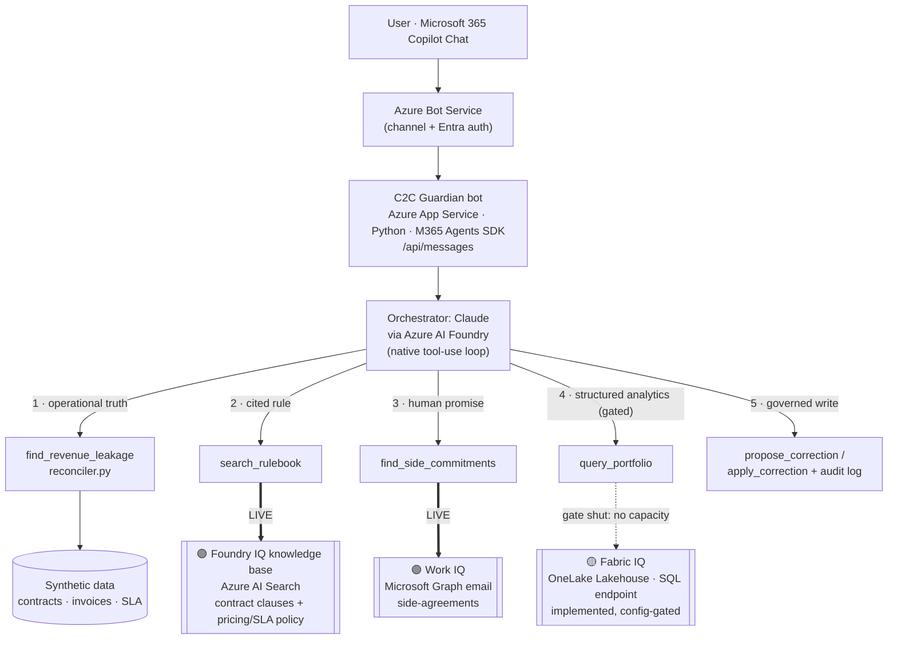

# Architecture — Contract-to-Cash Guardian

A **custom engine agent** in **Microsoft 365 Copilot Chat** that reconciles what
contracts **promised** vs what was **billed** vs what was **delivered**, proves every
finding with a **cited rule** (Foundry IQ), and proposes a **human-approved** fix.

## System diagram

*Detailed live-status flow:*

## Request flow (the multi-step reasoning)

1. **Operational truth** — the agent calls `find_revenue_leakage`, which runs the
   deterministic `reconciler.py` over synthetic contracts/invoices/SLA data and
   returns ranked, computed findings (total **$63,757**). Numbers are never
   produced by the model.
2. **Cited rule (Foundry IQ)** — for each finding, the agent calls `search_rulebook`,
   which retrieves the **exact clause/policy text** (e.g. *Clause 4.2 — Annual CPI
   Escalation*) from a Foundry IQ knowledge base (Azure AI Search). The citation is
   real contract language, not asserted by the model — this is what kills hallucination.
3. **Human promise (Work IQ)** — when a finding could be overridden by a
   side-agreement, the agent calls `find_side_commitments`, which reads emailed
   commitments from Microsoft 365 (Graph) so the "promised" side reflects reality.
4. **Structured analytics (Fabric IQ, config-gated)** — for portfolio-level questions
   (totals, exposure by customer, renewal/SLA risk across the book), the agent can call
   `query_portfolio` against a OneLake Lakehouse. The tool is registered **only when a
   Fabric capacity is connected**, so it is dormant in this deployment (see the honesty
   note below) — implemented, not run live.
5. **Governed action** — corrections are **proposals**; `apply_correction` runs only
   after a human approves, and every step is written to an **audit log**.

## The three Microsoft IQ layers

| Layer | Role here | Status in this repo | Code |
|---|---|---|---|
| **🟢 Foundry IQ** | The **rulebook** — retrieves cited clause/policy text for every finding | **Live** — real Azure AI Search retrieval | [`src/foundry_iq.py`](src/foundry_iq.py), [`scripts/build_rulebook_index.py`](scripts/build_rulebook_index.py) |
| **🟢 Work IQ** | The **human-promised** side — emailed side-agreements | **Live** — real Microsoft Graph retrieval (Mail.Read configured + verified); self-gates if creds absent | [`src/work_iq.py`](src/work_iq.py) |
| **🟡 Fabric IQ** | The **structured** business records as a semantic model — portfolio-level analytics (totals, exposure by customer, renewal/SLA risk across the book) | **Implemented, config-gated** — real OneLake Lakehouse **SQL analytics endpoint** code (Entra SP auth); `query_portfolio` is registered only when a capacity is connected. Gate **shut** here (tenant has no Fabric capacity), so **not run live** | [`src/fabric_iq.py`](src/fabric_iq.py) |

> **Honesty note for reviewers:** we only badge a layer "live" if the code actually
> calls it. **Foundry IQ** performs real retrieval (live). **Work IQ** is real Graph
> retrieval (Mail.Read configured and verified → live). **Fabric IQ** is real
> SQL-endpoint code with the gate **shut** here — `fabric_iq.is_configured()` returns
> False (no Fabric capacity in this tenant: workspace creation is disabled and the
> trial capacity is in a different region), so `query_portfolio` is never registered,
> the live agent is unchanged, and we do **not** claim Fabric IQ ran live. It activates
> with no code change once the five `FABRIC_*` values are supplied. `reconciler.py`
> remains the operational-truth engine over synthetic JSON.

## Why a custom engine agent (not declarative)

Declarative agents are gated behind a **paid Microsoft 365 Copilot license**;
**custom engine agents are usable on Copilot Chat (free/Basic)**. C2C Guardian is a
bot (Azure Bot + App Service) surfaced in Copilot via `copilotAgents.customEngineAgents`
in the Teams manifest — so it runs on a standard tenant without a Copilot add-on.

## Components

| Component | What it is |
|---|---|
| [`src/bot.py`](src/bot.py) | Bot endpoint (M365 Agents SDK, aiohttp) — `/api/messages` |
| [`src/agent_core.py`](src/agent_core.py) | Claude-via-Foundry orchestrator + the tool-use loop |
| [`src/reconciler.py`](src/reconciler.py) | Deterministic promised-vs-billed-vs-delivered engine |
| [`src/foundry_iq.py`](src/foundry_iq.py) | Foundry IQ retrieval (Azure AI Search) |
| [`src/work_iq.py`](src/work_iq.py) | Work IQ retrieval (Microsoft Graph) — live |
| [`src/fabric_iq.py`](src/fabric_iq.py) | Fabric IQ: OneLake Lakehouse SQL-endpoint analytics — config-gated |
| [`mcp_server/server.py`](mcp_server/server.py) | External MCP server: read + governed write tools (bonus) |
| [`appPackage/manifest.json`](appPackage/manifest.json) | Teams/Copilot app manifest (custom engine agent) |
| [`knowledge/`](knowledge/) | Synthetic clause library + pricing/SLA policy → Foundry IQ index |

## Security & responsible AI

- **Synthetic data only** — no real customer data, PII, or production config.
- **Microsoft Entra ID** auth on the bot (client-secret) and Azure Bot channel.
- **Human-in-the-loop** — corrections are proposals; `apply_correction` requires an approver.
- **Audit log + citation on every finding**; the agent states money owed *to the
  customer* vs *to the company* (fairness, not over-billing).
- Secrets live in `.env` / App Service settings (git-ignored), never in the repo.
