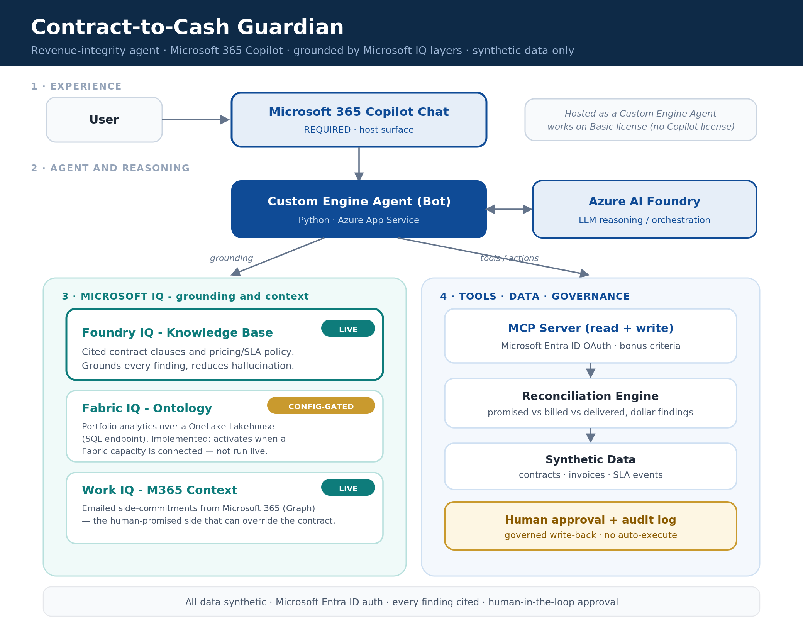

# 💰 Contract-to-Cash Guardian

> **An enterprise revenue-integrity agent for Microsoft 365 Copilot Chat.** It catches the money companies quietly lose between what a contract **promised**, what was **billed**, and what was **delivered** — proves every gap with the **exact contract clause**, and drafts the fix for a **human to approve** before anything changes.

**Agents League Hackathon — Enterprise Agents track** · Custom Engine Agent · Claude via **Azure AI Foundry** · grounded by **three Microsoft IQ layers**

### 🎥 [Watch the 2-minute demo →](https://vimeo.com/1201235695)

---

## 🔴 The problem

Every enterprise quietly loses an estimated **1–5% of revenue** in the gap between three systems that are *supposed* to agree but rarely do:

| **PROMISED** | **BILLED** | **DELIVERED** |
|---|---|---|
| What the contract committed — price, annual escalations, SLAs | What finance actually invoiced | What ops actually delivered — uptime |
| lives in **legal / CLM** | lives in the **billing system** | lives in **monitoring** |

**No single person reconciles all three.** So the gaps go unnoticed — and they compound:

- 📈 **Annual price escalations** (CPI clauses) silently never get applied → the company **under-bills**.
- ⬇️ **SLA credits** owed for downtime never get issued → the customer is **overcharged**.
- ⏳ **Contracts billed past their renewal date** → **out-of-contract exposure**.

It's invisible, it grows every billing cycle, and it's a **fairness** problem in *both* directions — companies lose money they're owed, and customers get charged for service levels they didn't receive.

---

## 🟢 What we're solving

**Contract-to-Cash Guardian** is the agent that **continuously reconciles promised vs billed vs delivered**. For every gap it finds, it:

1. **Computes the exact dollar amount** — deterministically, never guessed by the model.
2. **Proves it** — by quoting the *real* contract clause that backs the finding.
3. **Drafts a correction a human approves** — nothing is applied without sign-off, and every step is audited.
4. **Fixes errors in both directions** — money owed *to the company* **and** credits owed *to the customer*.

That last point is the key: it's a billing-**accuracy** tool, not an over-billing one — the framing that makes it safe to put in front of a real finance team.

> **Try it:** *"Find revenue leakage across the contract portfolio."*

```
TOTAL AT RISK: $63,757.00   (4 contracts, 5 findings)
  1. Renewal lapse risk      — Fabrikam Inc (C-1002)      $60,000   → company
  2. SLA credit owed         — Northwind Traders (C-1003)  $2,000   → customer  [Clause 6.2]
  3. Un-applied escalation   — Contoso Ltd (C-1001)          $816   → company   [Clause 4.2]
  4. SLA credit owed         — Contoso Ltd (C-1001)           $500   → customer  [Clause 7.3]
  5. Un-applied escalation   — Adventure Works (C-1004)       $441   → company   [Clause 4.2]
```

Every line carries the **cited clause text** (retrieved live), the **evidence**, and a **proposed, approval-gated** correction.

---

## ✨ Key features

| | Feature | Why it matters |
|---|---|---|
| 💵 | **Deterministic $ findings** | A pure-Python reconciliation engine computes every figure — the model **never invents a number**. |
| 📑 | **Cited, hallucination-proof evidence** | Each finding quotes the **actual contract clause**, retrieved from a knowledge base — not asserted by the LLM. |
| 🧠 | **Multi-IQ grounding (3 layers)** | Foundry IQ + Work IQ + Fabric IQ — one per data modality (see below). |
| ✅ | **Human-in-the-loop governance** | Corrections are **proposals**: `propose → approve → apply`, with a full **audit log**. |
| ⚖️ | **Both-directions fairness** | Surfaces under-billing *and* customer credits — accuracy, not clawback. |
| 💬 | **Runs in Copilot Chat — free tier** | A **Custom Engine Agent** (bot), so it works on Copilot Chat / Basic with **no paid Copilot license**. |
| 🔌 | **External MCP server (bonus)** | Read + governed-write tools over the Model Context Protocol, with an OAuth hook. |
| 🛡️ | **Graceful degradation** | Each IQ layer **self-gates** — missing creds disable it cleanly instead of crashing. |

---

## 🧠 The multi-IQ story — *one IQ layer per data modality*

Revenue truth isn't in one place, so one knowledge source isn't enough. C2C Guardian grounds on **three Microsoft IQ layers, each covering a different *kind* of data** — that's what makes the reasoning complete:

```
                          ┌─────────────────────────────────────────────┐
   UNSTRUCTURED           │  🟢 Foundry IQ   →  the cited RULEBOOK        │   "what the clause says"
   knowledge              │     Azure AI Search over contract clauses     │
                          ├─────────────────────────────────────────────┤
   UNSTRUCTURED           │  🟢 Work IQ      →  the human PROMISE          │   "what we agreed in email"
   work data              │     Microsoft Graph over side-agreement email │
                          ├─────────────────────────────────────────────┤
   STRUCTURED             │  🟡 Fabric IQ    →  the portfolio ONTOLOGY    │   "what the whole book shows"
   business records       │     OneLake Lakehouse · SQL analytics endpoint│
                          └─────────────────────────────────────────────┘
```

| Layer | Modality | What it grounds | Status (honest) | Code |
|---|---|---|---|---|
| **🟢 Foundry IQ** | Unstructured **knowledge** | Retrieves the **exact clause/policy text** behind every finding — kills hallucination on the highest-stakes data | **Live** — real Azure AI Search retrieval | [`src/foundry_iq.py`](src/foundry_iq.py) |
| **🟢 Work IQ** | Unstructured **work data** | Finds **emailed side-agreements** ("we agreed to waive Contoso's Q3 increase") that override the formal contract | **Live** — real Microsoft Graph retrieval (Mail.Read configured + verified) | [`src/work_iq.py`](src/work_iq.py) |
| **🟡 Fabric IQ** | Structured **business records** | **Portfolio-level analytics** — totals, exposure by customer, renewal/SLA risk across the whole book | **Implemented, config-gated** — real OneLake SQL-endpoint code; gate **shut** here (no Fabric capacity in tenant) | [`src/fabric_iq.py`](src/fabric_iq.py) |

> **Honesty note for reviewers.** We only badge a layer "live" if the code actually calls it. **Foundry IQ** performs real retrieval (live). **Work IQ** performs real retrieval (live) — Microsoft Graph with Mail.Read configured and verified. **Fabric IQ** is real SQL-endpoint code with the gate **shut** here — `fabric_iq.is_configured()` returns False (the tenant has no usable Fabric capacity), so its tool is never registered and the live agent is unchanged. It activates with **no code change** once the five `FABRIC_*` values are supplied. See [FABRIC-IQ-SETUP.md](FABRIC-IQ-SETUP.md). Nothing is overclaimed.

---

## 🏗️ Architecture

A custom engine agent in Copilot Chat. The orchestrator (Claude, via Azure AI Foundry) runs a **native tool-use loop**, chaining tools that map to the three sides of the problem **and** the three IQ layers.



> Full request flow, the per-layer IQ status table, and component breakdown: **[ARCHITECTURE.md](ARCHITECTURE.md)**.

**Why a Custom Engine Agent (not declarative):** declarative agents are gated behind a **paid Microsoft 365 Copilot license**; custom engine agents run on **Copilot Chat / Basic for free**. C2C Guardian surfaces in Copilot via `copilotAgents.customEngineAgents` in the Teams manifest — so it works on a standard tenant with no Copilot add-on.

---

## 📁 Repo layout

```
contract-to-cash-guardian/
├── src/
│   ├── bot.py            # Copilot bot endpoint (M365 Agents SDK, /api/messages)
│   ├── agent_core.py     # Claude-via-Foundry orchestrator + tool-use loop
│   ├── reconciler.py     # deterministic promised-vs-billed-vs-delivered engine
│   ├── foundry_iq.py     # Foundry IQ retrieval (Azure AI Search)        🟢 live
│   ├── work_iq.py        # Work IQ retrieval (Microsoft Graph)           🟢 live
│   ├── fabric_iq.py      # Fabric IQ: OneLake Lakehouse analytics         🟡 config-gated
│   └── run_demo.py       # CLI: prints the $63,757 report (no cloud)
├── mcp_server/server.py  # external MCP server: read + governed write (bonus)
├── knowledge/            # synthetic clause library + pricing/SLA policy → Foundry IQ
├── data/                 # synthetic contracts / invoices / SLA events
├── scripts/build_rulebook_index.py    # populates the Foundry IQ index
├── appPackage/           # Teams/Copilot manifest (custom engine agent) + icons
├── m365agents*.yml       # Microsoft 365 Agents Toolkit provisioning
└── ARCHITECTURE.md · FOUNDRY-IQ-SETUP.md · WORK-IQ-SETUP.md · FABRIC-IQ-SETUP.md · README.md
```

---

## 🚀 Quick start

### 1. See the brain work (no cloud)
```bash
python src/run_demo.py        # prints the ranked $63,757 report from synthetic data
```

### 2. Run the agent locally (Claude + tools)
```bash
python -m venv .venv && .venv/Scripts/pip install -r requirements.txt
cp .env.example .env          # fill FOUNDRY_ENDPOINT / FOUNDRY_API_KEY / FOUNDRY_MODEL_NAME
python src/bot.py             # bot on http://localhost:3978
# test in the Microsoft 365 Agents Playground:
npm i -g @microsoft/teams-app-test-tool && teamsapptester
```

### 3. Ground it with Foundry IQ (the cited rulebook)
Create an Azure AI Search resource and run the indexer — see **[FOUNDRY-IQ-SETUP.md](FOUNDRY-IQ-SETUP.md)**:
```bash
python scripts/build_rulebook_index.py
```
> **More IQ layers:** **Work IQ** (emailed side-agreements) runs live on Microsoft Graph — see **[WORK-IQ-SETUP.md](WORK-IQ-SETUP.md)**;
> **Fabric IQ** (structured portfolio analytics) is implemented and config-gated — see **[FABRIC-IQ-SETUP.md](FABRIC-IQ-SETUP.md)**.

### 4. Host it in Copilot Chat (always-on)
Deploy the bot to **Azure App Service**, register an **Azure Bot** pointed at it, and sideload the manifest (`m365agents.yml`) — it surfaces in Copilot as a **custom engine agent** on the free **Copilot Chat / Basic** tier, no paid Copilot license required.

---

## 🔌 Bonus: external MCP server (read + governed write)
```bash
DISABLE_AUTH=1 python mcp_server/server.py
```
Tools: `get_contracts`, `get_invoices`, `get_leakage_report` (read); `propose_correction`, `apply_correction`, `get_audit_log` (write, approval-gated). OAuth-against-Entra hook in `require_auth`.

---

## 🛡️ Security & responsible AI
- **Synthetic data only** — no real customer data, PII, tenant IDs, or production config in the repo.
- **Microsoft Entra ID** auth on the bot + Azure Bot channel; secrets live in `.env` / App Service settings (git-ignored), never committed.
- **Human-in-the-loop** — corrections are proposals; `apply_correction` requires a named approver.
- **Audit log + a citation on every finding**; the agent is explicit about money owed *to the customer* vs *to the company* (fairness, not over-billing).

---

## 🏆 How it maps to the judging rubric
| Criterion | How we hit it |
|---|---|
| **Accuracy & Relevance** | Hard-dollar enterprise problem; deterministic, **cited** findings (Foundry IQ) — no hallucinated numbers |
| **Reasoning & Multi-step** | promised-vs-billed-vs-delivered chain across reconciler → Foundry IQ → Work IQ → governed action |
| **Reliability & Safety** | Entra auth, human approval, audit log, cited retrieval, synthetic data only |
| **Creativity & Originality** | Revenue-integrity angle; corrects errors in **both directions** |
| **UX & Presentation** | Runs in Copilot Chat; ranked $ report + cited clauses + approval flow |
| **Best Use of IQ** | **Three IQ layers, one per data modality** — Foundry IQ (live) + Work IQ (live) + Fabric IQ (implemented, gated), each real code |

---

## 🧰 Tech stack
Microsoft 365 Agents SDK (Python) · Azure Bot Service · Azure App Service · Claude (Opus/Sonnet) via **Azure AI Foundry** · **Foundry IQ** (Azure AI Search) · Microsoft Graph (**Work IQ**) · Microsoft Fabric / OneLake (**Fabric IQ**, config-gated) · Model Context Protocol · Microsoft Entra ID.
